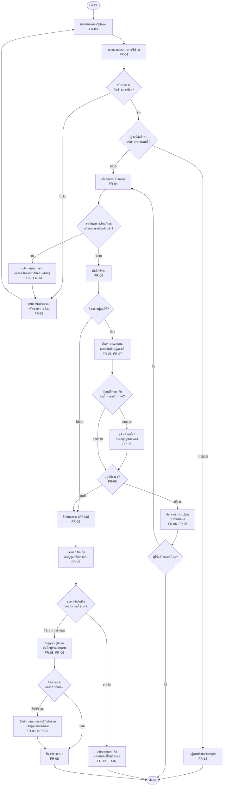
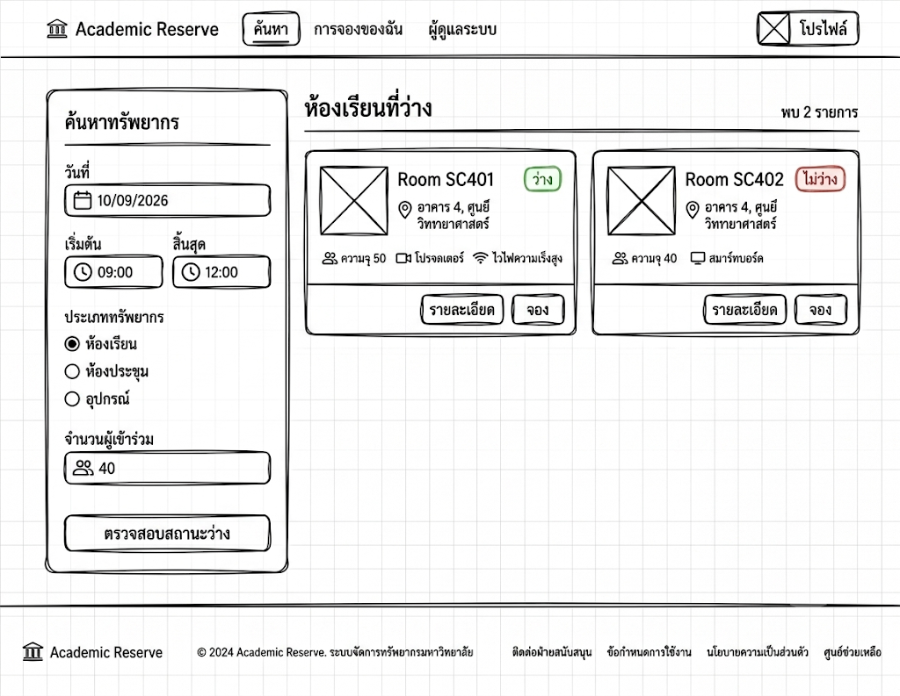
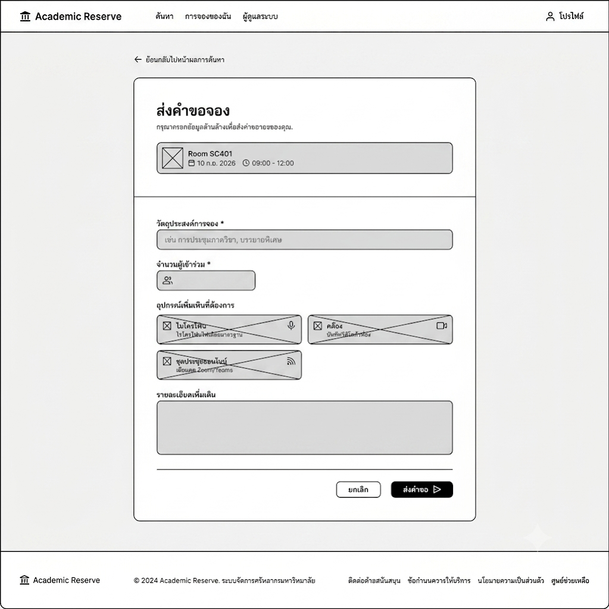
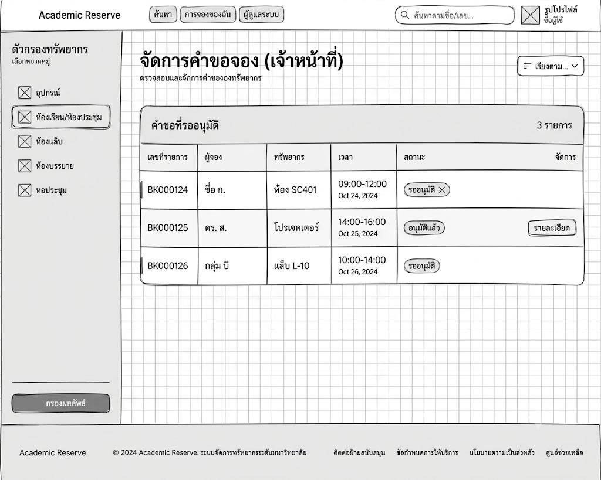

# WORKSHOP TEMPLATE

**Understanding User Requirements for Information Systems**
แบบฟอร์มสำหรับนิสิตใช้จัดทำผลงานกลุ่ม

| หัวข้อ | รายละเอียด |
|---|---|
| Group ID | 1 |
| โจทย์ Workshop | ระบบจองห้องเรียน ห้องประชุม และอุปกรณ์ภายในคณะ |
| รายวิชา | Business Process |
| วันที่จัดกิจกรรม | 7 สิงหาคม 2569 |
| ชื่อผู้ประสานงานกลุ่ม | |
| ช่องทางติดต่อ | |

### สมาชิกกลุ่ม

| ลำดับ | รหัสนิสิต | ชื่อ–นามสกุล | บทบาทในทีม |
|---|---|---|---|
| 1 | 67160003 | ชุติพนธ์ จิตต์รุ่งเรืองสุข | ร่างแบบเอกสาร |
| 2 | 67160005 | เมธาสิทธิ์ แก้วศรีทอง | จัดรูปแบบเอกสาร |
| 3 | 67160018 | ภูมิพัฒน์ ขันอาสา | คิดไอเดีย |
| 4 | 67160025 | ชิษณุพงศ์ โรจน์เลิศกิจจา | User Flow |
| 5 | 67160042 | มนทกานต์ ปาลี | Stakeholder List, Interview Questions, Wireframe |
| 6 | 67160178 | จตุพร ธรรมฤทธิ์ | Requirement List, Wireframe |
| 7 | 67160193 | พัชรพงษ์ สังข์กล่อม | Problem Statement และจัดคำในเอกสาร |
| 8 | 67160403 | พชร ปฏิมาการ | ตรวจทานเอกสาร |

### คำชี้แจงการจัดทำผลงาน

- ให้นิสิตทำหน้าที่เป็นทีม Business Analyst เพื่อทำความเข้าใจปัญหา ผู้ใช้งาน และความต้องการของระบบ ก่อนนำไปสู่การออกแบบ User Flow และ Wireframe เบื้องต้น
- ผลงานต้องแสดงให้เห็นความเชื่อมโยงจาก Problem → Stakeholder → Interview Question → Requirement → User Flow → Wireframe
- ไม่ประเมินจากความสวยของหน้าจอเป็นหลัก แต่พิจารณาว่าหน้าจอและกระบวนการตอบ Requirement จริงหรือไม่ และทีมสามารถอธิบายเหตุผลได้หรือไม่

### Output ที่ต้องส่ง

| ลำดับ | ชิ้นงาน | รายละเอียด |
|---|---|---|
| 1 | Problem Statement | อธิบายปัญหาปัจจุบัน ผู้ได้รับผลกระทบ และผลกระทบที่เกิดขึ้น |
| 2 | Stakeholder List | ระบุผู้เกี่ยวข้อง พร้อมบทบาท เป้าหมาย ปัญหา และข้อมูลที่ต้องการ |
| 3 | Interview Questions | คำถามสำหรับเก็บ Requirement อย่างน้อย 10 ข้อ |
| 4 | Requirement List | Requirement อย่างน้อย 8–10 ข้อ เขียนให้ชัดเจนและตรวจสอบได้ |
| 5 | User Flow | แสดงลำดับกระบวนการหลัก รวมทั้งจุดตัดสินใจหรือกรณีผิดปกติที่สำคัญ |
| 6 | Wireframe | หน้าจอตัวอย่างอย่างน้อย 3 หน้า พร้อมระบุ Requirement ที่แต่ละหน้ารองรับ |

### สิ่งที่ไม่ต้องทำ

- ไม่ต้องเขียน Code
- ไม่ต้องออกแบบ Database Schema เชิงลึก
- ไม่ต้องทำ System Architecture
- ไม่ต้องลงรายละเอียด Security เชิงเทคนิค
- ไม่ต้องทำ Prototype ที่สมบูรณ์

---

## 1. Problem Statement

### 1.1 สถานการณ์ปัจจุบัน

> **แก้จากรอบที่แล้ว** — ขั้นตอนที่ 4 ระบุเพิ่มว่ายังไม่มีเกณฑ์ตัดสินที่เป็นลายลักษณ์อักษร เพื่อให้เห็นว่าเป็นช่องว่างที่ต้องไปถาม ไม่ใช่สิ่งที่ทีมจะกำหนดเอง

คณะมีการใช้งานห้องเรียน ห้องประชุม และอุปกรณ์ส่วนกลางหลายประเภท เช่น โปรเจกเตอร์ ไมโครโฟน กล้องถ่ายวิดีโอ ชุดประชุมออนไลน์ และอุปกรณ์สำหรับกิจกรรมหรือการเรียนการสอน โดยใช้ร่วมกันระหว่างนิสิต อาจารย์ และเจ้าหน้าที่คณะ ซึ่งทรัพยากรเหล่านี้ถูกใช้ทั้งในงานประจำ เช่น ตารางเรียน และงานชั่วคราว เช่น การประชุม การจัดกิจกรรมนิสิต การสอบ การอบรม หรือการยืมอุปกรณ์ไปใช้นอกห้อง

ในการจองเพื่อใช้งานปัจจุบัน ผู้ใช้งานจะต้องติดต่อประสานงานผ่านหลายช่องทาง เช่น การแจ้งเจ้าหน้าที่โดยตรง โทรศัพท์ แอปพลิเคชัน LINE หรือการใช้เอกสารกระดาษ ส่งผลให้ข้อมูลตารางการจองกระจัดกระจายอยู่หลายแห่ง และไม่ได้รับการอัปเดตให้ตรงกันแบบเรียลไทม์

โดยกระบวนการทำงานในปัจจุบันมีขั้นตอนดังนี้

1. ผู้ใช้งานต้องติดต่อเจ้าหน้าที่เพื่อสอบถามสถานะความว่างของห้องหรืออุปกรณ์
2. ผู้ใช้งานแจ้งรายละเอียดวัน เวลา วัตถุประสงค์ และทรัพยากรที่ต้องการผ่านช่องทางต่าง ๆ (โทรศัพท์, LINE, เอกสาร)
3. เจ้าหน้าที่ต้องดำเนินการตรวจสอบตารางเรียน ตารางประชุม หรือสมุดจองจากแหล่งข้อมูลที่หลากหลายด้วยตนเอง
4. ในกรณีที่มีผู้ส่งคำขอใช้ทรัพยากรเดียวกันในช่วงเวลาใกล้เคียงกัน เจ้าหน้าที่ต้องเป็นผู้ตัดสินใจและแก้ไขข้อขัดแย้งด้วยตนเอง โดยยังไม่มีเกณฑ์ตัดสินที่เป็นลายลักษณ์อักษร
5. เจ้าหน้าที่แจ้งผลการอนุมัติ ปฏิเสธ หรือขอข้อมูลเพิ่มเติมกลับไปยังผู้ใช้งานตามช่องทางที่ติดต่อเข้ามา
6. ผู้ใช้งานเข้ารับกุญแจห้องหรืออุปกรณ์ตามวันเวลาที่กำหนด
7. หลังการใช้งานเสร็จสิ้น ผู้ดูแลอุปกรณ์อาจจะเข้ามาตรวจสอบการคืน สภาพ และความเสียหายของอุปกรณ์
8. เจ้าหน้าที่ทำการรวบรวมและสรุปสถิติการใช้งานย้อนหลังโดยการคัดลอกจากเอกสารหรือไฟล์หลายชุดที่มีอยู่

### 1.2 Problem Statement ฉบับสรุป

> **ไม่ได้แก้** — เนื้อหาเดิมทั้งหัวข้อ

กระบวนการบริหารจัดการห้องและอุปกรณ์ส่วนกลางของคณะในปัจจุบันยังคงใช้ระบบแมนนวลผ่านหลากหลายช่องทางที่กระจัดกระจาย ส่งผลให้ไม่สามารถตรวจสอบสถานะที่แท้จริงแบบเรียลไทม์ได้ และเสี่ยงต่อข้อมูลตกหล่น ในขณะที่เจ้าหน้าที่ผู้ดูแลต้องเผชิญความล่าช้าในขั้นตอนการตรวจสอบอนุมัติที่ต้องเช็กข้อมูลจากหลายแหล่งด้วยตนเอง ซึ่งมักนำไปสู่ความผิดพลาดและการจองซ้ำซ้อนกับตารางเรียน อีกทั้งยังขาดระบบติดตามการรับ-คืนและตรวจสอบสภาพทรัพย์สินที่มีประสิทธิภาพ ซึ่งท้ายที่สุดส่งผลกระทบทำให้กิจกรรมและการเรียนการสอนหยุดชะงัก ทรัพย์สินเสี่ยงต่อความชำรุดเสียหายโดยไม่มีผู้รับผิดชอบ และผู้บริหารขาดข้อมูลสถิติที่จำเป็นต่อการวางแผนจัดสรรทรัพยากรอย่างคุ้มค่า

**ใครมีปัญหา (Who)**

- กลุ่มผู้ใช้งาน (นิสิต, อาจารย์, เจ้าหน้าที่): ประสบความยุ่งยากในการประสานงานและตรวจสอบสถานะ
- เจ้าหน้าที่ผู้ดูแล: แบกรับภาระงานแมนนวลในการประสานงาน ตรวจสอบ และติดตามอุปกรณ์
- ผู้บริหารคณะ: ขาดข้อมูลประกอบการตัดสินใจเชิงกลยุทธ์

**เกิดขึ้นในขั้นตอนใด (Where & When)**

- ขั้นตอนการตรวจสอบความว่างและการยื่นจอง: ข้อมูลตารางจองไม่ได้รับการอัปเดตแบบเรียลไทม์ และส่งคำขอผ่านหลายช่องทาง
- ขั้นตอนการพิจารณาอนุมัติ: เจ้าหน้าที่ต้องเปิดเช็กข้อมูลจากสมุดจองหรือไฟล์หลายชุดด้วยตนเองเพื่อป้องกันตารางชนกัน
- ขั้นตอนการรับ-คืนและบำรุงรักษา: ขาดการบันทึกสภาพและตรวจสอบความเสียหายที่เป็นระบบ
- ขั้นตอนการประเมินผล: การรวบรวมสถิติการใช้งานทำได้ยากและล่าช้าเพราะต้องคัดลอกจากเอกสารหลายชุด

**ผลกระทบที่เกิดขึ้น (Impact)**

- **ความไร้ประสิทธิภาพ (Inefficiency):** เสียเวลาและทรัพยากรบุคคลไปกับขั้นตอนแมนนวลและการตอบคำถามซ้ำ ๆ
- **การดำเนินงานหยุดชะงัก (Operational Disruption):** เกิดการจองซ้ำซ้อนชนกับตารางเรียนประจำ ส่งผลเสียต่อการเรียนการสอน
- **ทรัพย์สินชำรุดเสียหาย (Asset Risk):** อุปกรณ์ชำรุดหรือสูญหายโดยไม่สามารถติดตามผู้รับผิดชอบย้อนหลังได้อย่างรวดเร็ว
- **การสูญเสียโอกาสเชิงกลยุทธ์ (Strategic Blindspot):** ไม่สามารถวิเคราะห์ความคุ้มค่าของการใช้งานทรัพยากรเพื่อวางแผนงบประมาณในอนาคตได้

### 1.3 หลักฐานหรือสมมติฐานที่ใช้

> **แก้จากรอบที่แล้ว** — คอลัมน์ขวาเดิมปนกันระหว่างสมมติฐานกับแนวทางแก้ที่ทีมเสนอ จึงเขียนใหม่ให้เป็นสมมติฐานที่ต้องตรวจสอบจริง เพิ่มคอลัมน์ "ต้องยืนยันกับใคร" ทุกแถว และเพิ่มข้อ 8 เรื่องเกณฑ์เวลาตอบสนอง

| ลำดับ | หลักฐาน / ข้อมูลที่ทราบ | สมมติฐาน / สิ่งที่ยังต้องตรวจสอบ | ต้องยืนยันกับใคร |
|---|---|---|---|
| 1 | ข้อมูลการจองกระจัดกระจาย ไม่อัปเดตแบบเรียลไทม์ ทำให้ตรวจสอบคิวและสถานะได้ยาก เพิ่มภาระงานเจ้าหน้าที่ | หากระบบใหม่มีปฏิทินกลางที่แสดงผลแบบเรียลไทม์ ผู้ใช้งานจะสามารถตรวจสอบความว่างได้ด้วยตนเองและติดตามสถานะคำขอได้ทันที ซึ่งคาดว่าจะช่วยลดปริมาณคำถามและภาระงานของเจ้าหน้าที่ ทั้งนี้ยังต้องยืนยันว่าลดลงในระดับใดจึงถือว่าเพียงพอ | เจ้าหน้าที่ |
| 2 | กระบวนการเดิมเสี่ยงต่อการจองซ้ำซ้อนและตารางชนกัน ทำให้เจ้าหน้าที่ต้องตรวจสอบและแก้ไขปัญหาด้วยตนเอง | ทีมตั้งสมมติฐานว่าตารางเรียน ตารางสอบ และกิจกรรมหลักควรมีสิทธิ์สูงสุด และการจองทั่วไปใช้หลักจองก่อนได้ก่อน แต่ยังไม่มีผู้กำหนดนโยบายยืนยัน จึงยังต้องตรวจสอบว่าเมื่อคำขอชนกันใช้เกณฑ์ใดตัดสิน และใครเป็นผู้ตัดสิน | ผู้บริหารคณะ / รองคณบดีฝ่ายวิชาการ |
| 3 | การอนุมัติแบบ Manual เป็นคอขวดของกระบวนการ ทำให้การอนุมัติล่าช้าและเพิ่มภาระงานของเจ้าหน้าที่ | ทีมตั้งสมมติฐานว่าสามารถแบ่งประเภททรัพยากรเพื่อใช้การอนุมัติอัตโนมัติและแบบเจ้าหน้าที่ตามระดับความสำคัญได้ แต่ยังต้องตรวจสอบว่าคำขอประเภทใดอนุมัติอัตโนมัติได้จริง | ผู้อนุมัติ / เจ้าหน้าที่ |
| 4 | กระบวนการรับคืนอุปกรณ์ยังไม่เป็นระบบ ทำให้ติดตามความเสียหาย ผู้รับผิดชอบ และการคืนล่าช้าได้ยาก เสี่ยงต่อความสูญเสียของทรัพย์สิน | ทีมตั้งสมมติฐานว่าการยืนยันตัวตนผู้จองและมาตรการเมื่อคืนล่าช้าหรือเสียหายจะช่วยส่งเสริมความรับผิดชอบ แต่ยังต้องตรวจสอบว่าคณะมีมาตรการใดอยู่แล้ว และสามารถระงับสิทธิ์ได้หรือไม่ | ผู้ดูแลอุปกรณ์ / ฝ่ายพัสดุ |
| 5 | ยังไม่มีเอกสารกำหนดชัดเจนว่าใครบ้างที่มีสิทธิ์จองห้องหรืออุปกรณ์แต่ละประเภท และคำขอประเภทใดต้องผ่านผู้อนุมัติ | ระบบควรกำหนดสิทธิ์ตามประเภทผู้ใช้งานและประเภททรัพยากร เพื่อยืนยันระดับสิทธิ์และเงื่อนไขการอนุมัติ | ผู้บริหารคณะ / System Admin |
| 6 | ผู้ใช้งานมีการขอยกเลิกหรือเปลี่ยนแปลงเมื่อใกล้ถึงเวลาที่จอง ซึ่งอาจส่งผลต่อการจัดสรรทรัพยากร | ระบบรองรับการแก้ไขหรือยกเลิกการจอง แต่ต้องตรวจสอบว่าผู้ใช้งานสามารถแก้ไขหรือยกเลิกได้ถึงช่วงเวลาใด และกรณีใกล้ถึงเวลาจองต้องมีเงื่อนไขเพิ่มเติมหรือไม่ | เจ้าหน้าที่ / ผู้อนุมัติ |
| 7 | ห้องแต่ละห้องมีข้อมูล (ประเภท ความจุ ชั้น และอุปกรณ์ประจำห้อง) ส่วนอุปกรณ์มีสถานะและผู้ดูแล | ผู้ใช้สามารถค้นหาทรัพยากรจากคุณสมบัติที่ต้องการได้ แต่ต้องตรวจสอบว่าคุณสมบัติใดจำเป็นต่อการตัดสินใจจอง | นิสิต / อาจารย์ / เจ้าหน้าที่ |
| 8 | ผู้ใช้งานต้องการทราบผลการค้นหาอย่างรวดเร็ว มิฉะนั้นจะกลับไปใช้วิธีโทรถามเหมือนเดิม | ยังไม่ทราบว่าเวลาตอบสนองเท่าใดที่ผู้ใช้ยอมรับได้ ตัวเลขที่จะใช้เป็นเกณฑ์ต้องได้จากผู้ใช้งานจริง ไม่ใช่จากการกำหนดเองของทีม | ผู้ใช้งานจริง / System Admin |

---

## 2. Stakeholder List

ระบุ Stakeholder ที่เกี่ยวข้องกับปัญหาและกระบวนการ ไม่ควรระบุเฉพาะผู้ใช้งานหน้าจอ แต่ให้รวมผู้อนุมัติ ผู้ดูแล ผู้รับข้อมูล และผู้ที่ได้รับผลกระทบ

> **แก้จากรอบที่แล้ว** — อำนาจของผู้ดูแลห้อง ผู้ดูแลอุปกรณ์ และเจ้าหน้าที่ เดิมเขียนว่า "อนุญาตการใช้งาน" และ "อนุญาตการยืม-คืน" เปลี่ยนเป็นสิ่งที่ทำจริง แล้วกำกับว่าอำนาจอนุมัติยังต้องยืนยัน เพราะผู้ที่ดูแลทรัพยากรไม่จำเป็นต้องเป็นผู้มีอำนาจอนุมัติตามระเบียบ

| ลำดับ | Stakeholder | บทบาท | เป้าหมาย / Need | Pain Point | อำนาจตัดสินใจ / ข้อมูลที่ต้องใช้ |
|---|---|---|---|---|---|
| 1 | นิสิต | ผู้ใช้งานหลักในการจองห้อง/อุปกรณ์ | จองง่าย รวดเร็ว รู้ผลทันที | ไม่รู้สถานะห้อง ต้องถามหลายช่องทาง | ยื่นคำขอจองโดยเลือกห้องและเวลา \| ตารางห้องว่าง, รายละเอียดห้อง, สถานะการจอง |
| 2 | อาจารย์ | ใช้ห้องเพื่อการสอน/ประชุม | ได้ห้องตรงเวลา ไม่มีตารางชน | ตารางชน / ไม่ได้ห้องตามต้องการ | ยื่นคำขอจองโดยระบุห้อง/เวลา/ความต้องการพิเศษ (ยังต้องยืนยันว่ามีสิทธิ์เหนือกว่าผู้ใช้กลุ่มอื่นหรือไม่) \| ตารางใช้งาน, ความจุห้อง, อุปกรณ์ในห้อง |
| 3 | เจ้าหน้าที่ | จัดการการจอง | ลดงานซ้ำซ้อน ทำงานง่ายขึ้น | ต้องเช็กหลายช่องทาง (LINE, โทร, เอกสาร) | ตรวจสอบและจัดคิวคำขอ (ยังต้องยืนยันว่ามีอำนาจอนุมัติเองในกรณีใดบ้าง) \| รายการจองทั้งหมด, ตารางรวม, ข้อมูลผู้จอง |
| 4 | ผู้อนุมัติ | อนุมัติ/ปฏิเสธคำขอ | ตัดสินใจถูกต้อง รวดเร็ว | ข้อมูลไม่ครบ ตัดสินใจยาก | อนุมัติ/ปฏิเสธคำขอ \| รายละเอียดการจอง, วัตถุประสงค์, ความสำคัญ |
| 5 | ผู้ดูแลห้อง | ดูแลความพร้อมของห้อง | ห้องพร้อมใช้งานเสมอ | ไม่มีแจ้งเตือนล่วงหน้า | แจ้งสถานะความพร้อมของห้อง (ยังต้องยืนยันว่ามีอำนาจอนุญาตการใช้งานหรือไม่) \| ตารางการใช้งาน, สถานะห้อง, การแจ้งเตือน |
| 6 | ผู้ดูแลอุปกรณ์ | ดูแลอุปกรณ์ (โปรเจกเตอร์, ไมค์) | ติดตามการใช้งานและการคืน | อุปกรณ์หาย/เสีย ไม่รู้ว่าใครใช้ | บันทึกการจ่ายและรับคืนอุปกรณ์ (ยังต้องยืนยันว่ามีอำนาจอนุญาตการยืม-คืนหรือไม่) \| รายการอุปกรณ์, สถานะ, ประวัติการใช้งาน |
| 7 | ผู้บริหาร | วางแผนและตัดสินใจ | เห็นภาพรวมการใช้งาน | ไม่มีรายงานหรือสถิติ | กำหนดนโยบายและวางแผนจัดสรรทรัพยากร \| สถิติการใช้งาน, รายงานภาพรวม |
| 8 | System Admin | ดูแลระบบ IT | ระบบเสถียร ปลอดภัย | การจัดการสิทธิ์ซับซ้อน/แก้ไขปัญหาช้า | กำหนดสิทธิ์ในระบบตามนโยบายที่ได้รับอนุมัติ \| ข้อมูลสิทธิ์ผู้ใช้งาน, บันทึกการเข้าใช้งานระบบ |

### Stakeholder ที่สำคัญที่สุด 3 กลุ่ม

1. **นิสิต** – เป็นผู้ใช้งานหลักของระบบ หากใช้งานไม่สะดวกจะทำให้ระบบไม่ถูกใช้งานจริง
2. **เจ้าหน้าที่** – เป็นผู้จัดการกระบวนการจอง หากระบบไม่ช่วยลดงาน จะยังคงเกิดความซ้ำซ้อนเหมือนเดิม
3. **ผู้อนุมัติ** – เป็นผู้ตัดสินใจสำคัญ หากข้อมูลไม่ครบหรืออนุมัติล่าช้า จะทำให้กระบวนการทั้งหมดติดขัด

หมายเหตุ: อำนาจอนุมัติของผู้ดูแลห้อง ผู้ดูแลอุปกรณ์ และเจ้าหน้าที่ในตารางข้างต้น เป็นสิ่งที่ทีมยังต้องยืนยันกับคณะก่อน เนื่องจากผู้ที่ดูแลทรัพยากรอาจไม่ใช่ผู้มีอำนาจอนุมัติตามระเบียบ

---

## 3. Interview Questions

จัดทำคำถามอย่างน้อย 10 ข้อ ควรเป็นคำถามปลายเปิด ไม่ชี้นำ และครอบคลุม Current Process, Pain Point, Data, Business Rule, Exception, Permission และ Success Criteria

> **แก้จากรอบที่แล้ว** — เพิ่มข้อ 13–20 ครอบคลุมกฎการตัดสินเมื่อคำขอชนกัน ระยะเวลาจอง เงื่อนไขการยกเลิก Buffer Time มาตรการเมื่อคืนล่าช้า ระยะเวลาพิจารณาอนุมัติ เกณฑ์เวลาตอบสนอง และ Permission · และตัดตัวอย่างชี้นำออกจากข้อ 7 ให้ถามปลายเปิดก่อนแล้วค่อย Probe

| ข้อ | ถาม Stakeholder ใด | คำถามสัมภาษณ์ | สิ่งที่ต้องการค้นหา |
|---|---|---|---|
| 1 | กลุ่มผู้ใช้งานทั่วไป | ปัจจุบันคุณพบปัญหาอะไรบ้างในขั้นตอนการจองห้องหรืออุปกรณ์? | Pain Point ของกระบวนการปัจจุบัน |
| 2 | เจ้าหน้าที่ผู้ดูแล | ขั้นตอนการตรวจสอบการจองซ้ำซ้อนในปัจจุบันทำอย่างไร? | Current Process |
| 3 | ผู้บริหารคณะ | ข้อมูลสถิติประเภทใดที่จำเป็นต่อการวางแผนจัดสรรทรัพยากร? | Requirement สำหรับการออกรายงาน |
| 4 | นิสิต | ปกติคุณเลือกห้องหรืออุปกรณ์จากปัจจัยอะไรบ้าง? | Decision Criteria |
| 5 | อาจารย์ | หากห้องหรืออุปกรณ์ที่ต้องการไม่ว่าง คุณมีแนวทางแก้ไขหรือปรับแผนอย่างไร? | Exception Handling |
| 6 | เจ้าหน้าที่ | ก่อนจะยืนยันหรือบันทึกการจอง จำเป็นต้องตรวจสอบข้อมูลอะไรบ้างเพื่อให้ถูกต้องครบถ้วน? | Data Requirement |
| 7 | ผู้อนุมัติ | ปัจจัยหรือเงื่อนไขใดบ้างที่ใช้พิจารณาอนุมัติหรือปฏิเสธคำขอ? (หากผู้ให้สัมภาษณ์ตอบไม่ครบ จึงถามต่อว่า "มีกรณีใดบ้างที่เคยปฏิเสธ และปฏิเสธเพราะอะไร") | Approval Rule |
| 8 | ผู้ดูแลห้อง | ก่อนถึงเวลาการใช้งานจริง คุณต้องเตรียมห้องอย่างไร และต้องการข้อมูลอะไรล่วงหน้าเพื่อให้ห้องพร้อมใช้งาน? | Operational Process + Data |
| 9 | ผู้ดูแลอุปกรณ์ | ปัจจุบันมีวิธีติดตามการยืม-คืนอุปกรณ์อย่างไร และมีปัญหาอะไรเกิดขึ้นบ่อย? | Current Process + Pain Point |
| 10 | System Admin | ในการดูแลระบบจอง ปัญหาที่เกิดขึ้นบ่อยคืออะไร และมีผลกระทบต่อผู้ใช้งานอย่างไร? | Technical Pain Point |
| 11 | ผู้ใช้งานใหม่ | หากคุณเพิ่งเริ่มใช้ระบบ สิ่งใดที่ทำให้เข้าใจยากหรือสับสน? | Usability Issue |
| 12 | ผู้บริหาร | สำหรับคุณ ระบบนี้จะถือว่าประสบความสำเร็จได้ ต้องมีผลลัพธ์หรือการเปลี่ยนแปลงอะไรเกิดขึ้นบ้าง? | Success Criteria |
| 13 | ผู้อนุมัติ / เจ้าหน้าที่ | เมื่อมีคำขอใช้ห้องหรืออุปกรณ์เดียวกันในเวลาเดียวกัน ปัจจุบันใครเป็นผู้ตัดสิน และใช้เกณฑ์อะไรตัดสิน? | Conflict Resolution Rule และผู้มีอำนาจตัดสินใจ |
| 14 | ผู้บริหาร / รองคณบดีฝ่ายวิชาการ | การใช้งานประเภทใดบ้างที่ควรได้รับสิทธิ์ก่อนประเภทอื่น และมีระเบียบหรือประกาศใดกำหนดไว้แล้วหรือไม่? | Resource Priority Policy และแหล่งที่มาของกฎ |
| 15 | เจ้าหน้าที่ / ผู้ดูแลห้อง | ผู้ใช้ต้องยื่นจองล่วงหน้าอย่างน้อยกี่วัน จองต่อครั้งได้นานสูงสุดเท่าไร และต้องเว้นเวลาสำหรับจัดเตรียมห้องระหว่างการจองสองรายการหรือไม่? | Booking Lead Time, Max Duration และ Buffer Time |
| 16 | เจ้าหน้าที่ / ผู้อนุมัติ | ผู้ใช้สามารถแก้ไขหรือยกเลิกการจองได้ถึงเมื่อไร และหากยกเลิกกระชั้นชิดจะมีผลอย่างไร? | Cancellation / Modification Cutoff |
| 17 | ผู้ดูแลอุปกรณ์ / ฝ่ายพัสดุ | หากผู้ยืมคืนอุปกรณ์ล่าช้าหรือคืนในสภาพเสียหาย ปัจจุบันดำเนินการอย่างไร? | Exception และมาตรการที่ใช้อยู่จริง |
| 18 | ผู้อนุมัติ | คำขอหนึ่งควรได้รับการพิจารณาภายในเวลาเท่าไร และหากผู้อนุมัติไม่สะดวก ใครพิจารณาแทนได้? | Approval SLA และผู้อนุมัติสำรอง |
| 19 | ผู้ใช้งานจริง (นิสิต / อาจารย์) | ในการค้นหาห้องว่าง ความเร็วในการแสดงผลระดับใดที่คุณถือว่ายอมรับได้ และระดับใดที่ถือว่าช้าจนไม่อยากใช้? | เกณฑ์ Performance ที่มาจากผู้ใช้จริง |
| 20 | ผู้บริหารคณะ / เจ้าหน้าที่ | ปัจจุบันผู้ใช้กลุ่มใดจองห้องหรืออุปกรณ์ประเภทใดได้บ้าง มีกรณีที่ต้องขออนุญาตเป็นพิเศษหรือไม่ และใครเป็นผู้มีอำนาจอนุญาตในแต่ละกรณี? | Permission และผู้มีอำนาจอนุญาตตัวจริง |

---

## 4. Requirement List

Requirement ควรเขียนให้ชัดเจน มีผู้ใช้หรือผู้รับผิดชอบ ระบุสิ่งที่ระบบต้องทำ และสามารถตรวจสอบได้ ควรหลีกเลี่ยงคำกำกวม เช่น ง่าย เร็ว สวย เหมาะสม โดยไม่มีเกณฑ์

> **แก้จากรอบที่แล้ว** — FR-02 เดิมเป็นกฎ "ตารางเรียนและสอบมีสิทธิ์สูงสุด" ซึ่งเป็นสมมติฐานของทีม เปลี่ยนเป็นการตรวจสอบการชนของช่วงเวลา · FR-07 เดิมซ้ำกับ FR-05 เปลี่ยนเป็นการแจ้งเตือนอัตโนมัติ · เพิ่ม FR-12 แก้ไข/ยกเลิก และ FR-13 ตั้งค่าสิทธิ์และลำดับความสำคัญ · แยก NFR ออกจากหมวด Functional และเปลี่ยนเกณฑ์ 3 วินาทีให้กำกับว่าเป็นค่าที่ทีมเสนอ

| ID | ประเภท | Stakeholder | Requirement | เหตุผล / Problem ที่รองรับ | Priority |
|---|---|---|---|---|---|
| FR-01 | Functional | นิสิต, อาจารย์ | ระบบต้องแสดงสถานะว่าง/ไม่ว่างของห้องและอุปกรณ์แบบเรียลไทม์จากแหล่งข้อมูลเดียว | ลดการสอบถามเจ้าหน้าที่ ปัญหาการจองซ้ำและข้อมูลไม่ตรงกัน | High |
| FR-02 | Functional | เจ้าหน้าที่, ผู้อนุมัติ | ระบบต้องตรวจสอบการชนกันของช่วงเวลากับตารางเรียน ตารางสอบ และการจองที่ยืนยันแล้ว ก่อนรับคำขอ และเมื่อพบการชนต้องแจ้งเหตุผลพร้อมเสนอช่วงเวลาหรือทรัพยากรทางเลือก | ป้องกันตารางชนกันโดยไม่ต้องให้เจ้าหน้าที่ตรวจสอบเอง | Critical |
| FR-03 | Functional | นิสิต, อาจารย์ | ระบบต้องให้ผู้ใช้ค้นหาห้องหรืออุปกรณ์ตามวันที่ เวลา ประเภท และความจุได้ | ค้นหาทรัพยากรที่ตรงตามความต้องการได้ยาก ต้องสอบถามเจ้าหน้าที่ทีละรายการ | High |
| FR-04 | Functional | นิสิต, อาจารย์ | ระบบต้องให้ผู้ใช้ส่งคำขอจองออนไลน์ โดยบังคับกรอกวัตถุประสงค์ ช่วงเวลา และจำนวนผู้เข้าร่วม | ลดการจองหลายช่องทางและปัญหาข้อมูลไม่ครบ | High |
| FR-05 | Functional | นิสิต, อาจารย์ | ระบบต้องแสดงสถานะคำขอ (รออนุมัติ, อนุมัติ, ปฏิเสธ, ยกเลิก) ให้ผู้ใช้สามารถติดตามได้ | ผู้ใช้ไม่ทราบสถานะคำขอ | High |
| FR-06 | Functional | ผู้อนุมัติ | ระบบต้องอนุมัติหรือปฏิเสธคำขอได้ โดยกรณีปฏิเสธต้องระบุเหตุผลประกอบ | จัดการคำขอได้รวดเร็ว และผู้ใช้ทราบสาเหตุที่ถูกปฏิเสธ | High |
| FR-07 | Functional | นิสิต, อาจารย์, ผู้อนุมัติ, ผู้ดูแล | ระบบต้องแจ้งเตือนอัตโนมัติไปยังผู้เกี่ยวข้องเมื่อมีคำขอใหม่เข้ามา และทุกครั้งที่สถานะคำขอเปลี่ยนแปลง | การเปลี่ยนแปลงหรือยกเลิกการจองไม่ถูกสื่อสารไปยังทุกฝ่าย | High |
| FR-08 | Functional | เจ้าหน้าที่, ผู้ดูแลอุปกรณ์ | ระบบต้องบันทึกการรับและคืนอุปกรณ์ พร้อมระบุผู้รับผิดชอบและวันเวลารับ-คืน | ติดตามการใช้อุปกรณ์และผู้ถือครองได้ | Medium |
| FR-09 | Functional | เจ้าหน้าที่, ผู้ดูแลอุปกรณ์ | ระบบต้องบันทึกสภาพและความเสียหายของอุปกรณ์ ณ เวลารับและเวลาคืน | ตรวจสอบความเสียหายและหาผู้รับผิดชอบย้อนหลังได้ | Medium |
| FR-10 | Functional | ผู้ดูแลห้อง, ผู้ดูแลอุปกรณ์, System Admin | ระบบต้องให้ผู้ดูแลเพิ่ม แก้ไข หรือปิดการใช้งานห้องและอุปกรณ์ได้ | รองรับการจัดการทรัพยากร | Medium |
| FR-11 | Functional | ผู้บริหาร | ระบบต้องสรุปรายงานการใช้งานห้องและอุปกรณ์ตามช่วงเวลาและประเภททรัพยากร | ใช้วิเคราะห์การใช้งานและวางแผนทรัพยากร | Medium |
| FR-12 | Functional | นิสิต, อาจารย์ | ระบบต้องให้ผู้จองแก้ไขหรือยกเลิกการจองได้ภายในเงื่อนไขเวลาที่ผู้ดูแลกำหนดค่าได้ และเมื่อยกเลิกต้องคืนช่วงเวลานั้นให้ผู้อื่นจองได้ทันที | การยกเลิกกระชั้นชิดทำให้ทรัพยากรถูกล็อกไว้โดยไม่ได้ใช้ | Medium |
| FR-13 | Functional | System Admin, ผู้บริหาร | ระบบต้องให้ผู้ดูแลระบบกำหนดสิทธิ์การจองตามประเภทผู้ใช้และประเภททรัพยากร และกำหนดลำดับความสำคัญที่ใช้ตัดสินเมื่อคำขอชนกันได้ | ยังไม่มีข้อกำหนดว่าใครจองอะไรได้และใช้เกณฑ์ใดตัดสิน ระบบจึงต้องตั้งค่าได้เมื่อคณะกำหนดนโยบายแล้ว | High |
| NFR-01 | Non-functional | ผู้ใช้ทุกกลุ่ม | ระบบต้องแสดงผลการค้นหาห้องหรืออุปกรณ์ภายใน 3 วินาที หลังจากผู้ใช้กดค้นหา (ตัวเลขนี้เป็นค่าที่ทีมเสนอ ยังต้องยืนยันกับผู้ใช้งานจริงตามคำถามข้อ 19) | หากค้นหาช้าผู้ใช้จะกลับไปใช้วิธีโทรถามเหมือนเดิม เกณฑ์ 3 วินาทีเสนอไว้เพราะเป็นช่วงที่ผู้ใช้ยังรอหน้าจอได้โดยไม่เปลี่ยนไปทำอย่างอื่น และเป็นตัวเลขที่ทดสอบได้จริง ต่างจากการเขียนว่า "ระบบต้องเร็ว" | Low |
| NFR-02 | Non-functional | ผู้ดูแลอุปกรณ์, System Admin | ระบบต้องบันทึกประวัติการสร้าง แก้ไข อนุมัติ ปฏิเสธ และยกเลิกการจอง พร้อมผู้กระทำและเวลา | ตรวจสอบย้อนหลังได้ว่าใครรับผิดชอบทรัพยากรในแต่ละช่วงเวลา | Medium |

### Business Rule ที่ยังต้องยืนยันก่อนนำไปกำหนดค่าในระบบ

> **เพิ่มใหม่** — ย้ายกฎที่ทีมกำหนดเองออกจาก Requirement List มารวมไว้ที่นี่ทั้งหมด พร้อมค่าที่เสนอและผู้ที่ต้องยืนยัน หลักคือ "ระบบต้องตั้งค่าได้" เป็น Requirement ส่วน "ค่าเป็นเท่าไร" เป็นสิ่งที่ต้องไปถาม

Requirement ข้างต้นระบุเฉพาะความสามารถที่ระบบต้องมี ส่วนค่าของกฎต่อไปนี้เป็นค่าที่ทีมเสนอไว้เพื่อให้ออกแบบต่อได้ แต่ยังไม่ได้รับการยืนยันจากผู้มีอำนาจ จึงกำกับสถานะไว้เป็นสมมติฐาน และเมื่อได้รับการยืนยันแล้วจึงนำไปตั้งค่าในระบบตาม FR-13

| ลำดับ | Business Rule ที่ทีมเสนอ | ค่าที่เสนอ | เหตุผลที่เสนอค่านี้ | สถานะ | ต้องยืนยันกับ | คำถามข้อที่เกี่ยวข้อง |
|---|---|---|---|---|---|---|
| BR-01 | ลำดับความสำคัญเมื่อคำขอชนกัน | ตารางเรียน ตารางสอบ และกิจกรรมหลักของคณะมีสิทธิ์สูงกว่าการจองทั่วไป ส่วนการจองทั่วไปใช้หลักจองก่อนได้ก่อน | ตารางเรียนและตารางสอบเป็นพันธกิจหลักของคณะและกระทบนิสิตจำนวนมากที่สุดหากถูกย้าย ส่วนการจองทั่วไปใช้จองก่อนได้ก่อนเพราะเป็นเกณฑ์ที่ตรวจสอบย้อนหลังได้และไม่ต้องใช้ดุลยพินิจรายบุคคล | สมมติฐาน รอยืนยัน | ผู้บริหาร / รองคณบดีฝ่ายวิชาการ | 13, 14 |
| BR-02 | เงื่อนไขการอนุมัติ | ห้องเรียนและอุปกรณ์ทั่วไปอนุมัติอัตโนมัติเมื่อไม่ชนตาราง ส่วนห้องประชุมและอุปกรณ์มูลค่าสูงต้องผ่านผู้อนุมัติ | แบ่งตามระดับความเสี่ยง ทรัพยากรที่เสียหายหรือถูกแย่งใช้แล้วกระทบมากจึงต้องมีผู้กลั่นกรอง ส่วนที่ความเสี่ยงต่ำให้ผ่านอัตโนมัติเพื่อลดคอขวดการอนุมัติซึ่งเป็นปัญหาเดิม | สมมติฐาน รอยืนยัน | ผู้อนุมัติ / เจ้าหน้าที่ | 7, 13, 20 |
| BR-03 | เงื่อนไขการแก้ไข/ยกเลิก | แก้ไขหรือยกเลิกได้จนถึง 24 ชั่วโมงก่อนเวลาเริ่มใช้งาน หลังจากนั้นต้องติดต่อเจ้าหน้าที่ | ให้เวลาอย่างน้อยหนึ่งวันทำการสำหรับปล่อยคิวให้ผู้อื่นจองแทนได้ทัน หากสั้นกว่านี้ทรัพยากรจะถูกล็อกไว้โดยไม่ได้ใช้ ซึ่งเป็นปัญหาที่ระบุไว้ใน FR-12 | สมมติฐาน รอยืนยัน | เจ้าหน้าที่ / ผู้อนุมัติ | 16 |
| BR-04 | ระยะเวลาการจอง | จองล่วงหน้าอย่างน้อย 1 วันทำการ ไม่เกิน 30 วัน และจองต่อครั้งได้ไม่เกิน 4 ชั่วโมง | 1 วันทำการเพื่อให้ผู้ดูแลเตรียมห้องและอุปกรณ์ได้ทัน · 30 วันเพื่อกันการจองกั๊กระยะยาวที่อาจไม่ได้ใช้จริง · 4 ชั่วโมงเทียบเท่าคาบเรียนครึ่งวัน ซึ่งครอบคลุมการประชุมและกิจกรรมส่วนใหญ่ | สมมติฐาน รอยืนยัน | เจ้าหน้าที่ / ผู้ดูแลห้อง | 15 |
| BR-05 | Buffer Time | เว้น 15 นาทีระหว่างการจองสองรายการที่ใช้ห้องเดียวกัน เพื่อให้ผู้ดูแลจัดเตรียมห้อง | เป็นเวลาขั้นต่ำสำหรับเก็บของ จัดโต๊ะ และเซ็ตอุปกรณ์ หากไม่เว้นเลยจะเกิดกรณีผู้ใช้รายถัดไปเข้าห้องไม่ได้ตามเวลาที่จอง ซึ่งจะกลายเป็นข้อร้องเรียนใหม่ | สมมติฐาน รอยืนยัน | ผู้ดูแลห้อง | 15 |
| BR-06 | มาตรการเมื่อคืนล่าช้าหรือเสียหาย | ระบบบันทึกประวัติและแจ้งผู้ดูแล หากเกิดซ้ำเกินเกณฑ์ที่คณะกำหนด จะระงับสิทธิ์การยืมชั่วคราว | มาตรการต้องมีผลจริงจึงจะเปลี่ยนพฤติกรรมได้ แต่เริ่มจากบันทึกและแจ้งเตือนก่อน แล้วระงับสิทธิ์เฉพาะกรณีเกิดซ้ำ เพื่อไม่ลงโทษความผิดพลาดครั้งเดียว | สมมติฐาน รอยืนยัน | ผู้ดูแลอุปกรณ์ / ฝ่ายพัสดุ | 17 |
| BR-07 | ระยะเวลาพิจารณาอนุมัติ | ผู้อนุมัติพิจารณาภายใน 2 วันทำการ หากเกินกำหนด ระบบแจ้งเตือนซ้ำและส่งต่อผู้อนุมัติสำรอง | ผู้อนุมัติเป็นอาจารย์ที่มีภาระสอน จึงเผื่อมากกว่า 1 วัน แต่ไม่ให้คำขอค้างข้ามสัปดาห์ เพราะการอนุมัติล่าช้าเป็นคอขวดเดิมของกระบวนการ | สมมติฐาน รอยืนยัน | ผู้อนุมัติ | 18 |
| BR-08 | สิทธิ์การจองตามประเภทผู้ใช้ | นิสิตจองห้องเรียนและอุปกรณ์ทั่วไปได้ อาจารย์และเจ้าหน้าที่จองได้ทุกประเภท ส่วนห้องประชุมใหญ่ต้องขออนุญาตเป็นกรณีไป | สอดคล้องกับ BR-02 คือคุมเฉพาะทรัพยากรที่มีการแย่งใช้สูงหรือมูลค่าสูง ส่วนทรัพยากรทั่วไปเปิดให้ทุกกลุ่มเข้าถึงได้ เพื่อไม่ให้ระบบใหม่สร้างขั้นตอนมากกว่าเดิม | สมมติฐาน รอยืนยัน | ผู้บริหารคณะ | 20 |

---

## 5. User Flow

แสดง Main Flow ของกระบวนการ และควรมีอย่างน้อย 1 Decision Point หรือ Exception Flow

### 5.1 Actor และเป้าหมายของ Flow

> **แก้จากรอบที่แล้ว** — เป้าหมายของ Flow เพิ่มว่าระบบต้องกันการจองที่ชนกับตารางเรียน/สอบก่อนยืนยัน · และแก้ Requirement ที่เกี่ยวข้องจากเดิม "FR-03 → FR-06" เป็น FR-01 ถึง FR-09, FR-12, FR-13 ให้ครอบคลุม Flow จริงที่รวมการตรวจสิทธิ์ การตรวจการชน การยกเลิก และการรับ-คืนอุปกรณ์

| หัวข้อ | รายละเอียด |
|---|---|
| Actor หลัก | นิสิต |
| เป้าหมายของ Flow | เพื่อให้นิสิตสามารถค้นหาและจองห้อง/อุปกรณ์ โดยรู้สถานะการจองได้แบบเรียลไทม์ ติดตามได้โดยไม่ต้องพึ่งเจ้าหน้าที่ และระบบต้องกันการจองที่ชนกับตารางเรียน/สอบก่อนยืนยัน |
| Requirement ที่เกี่ยวข้อง | FR-01 ถึง FR-09, FR-12, FR-13 |

### 5.2 Main Flow

> **แก้จากรอบที่แล้ว** — เดิมมี 8 ขั้นตอน เพิ่มเป็น 12 โดยเพิ่ม Step 3 ตรวจสิทธิ์ผู้จอง และ Step 5 ตรวจการชนกับตารางเรียน/สอบ ก่อนบันทึกคำขอ · และแก้ Requirement ID ของ Step 2 จาก FR-03 เป็น FR-01

| Step | ผู้ดำเนินการ | Action / System Response | Requirement ID |
|---|---|---|---|
| 1 | นิสิต | เข้าสู่ระบบและค้นหาห้อง/อุปกรณ์ตามวันที่ เวลา ประเภท ความจุ | FR-03 |
| 2 | ระบบ | แสดงสถานะห้อง/อุปกรณ์ว่าง-ไม่ว่างแบบเรียลไทม์ | FR-01 |
| 3 | ระบบ | ตรวจสอบสิทธิ์ของผู้ขอกับประเภททรัพยากรที่เลือก | FR-13 |
| 4 | นิสิต | เลือกและส่งคำขอจองออนไลน์ พร้อมระบุวัตถุประสงค์และจำนวนผู้เข้าร่วม | FR-04 |
| 5 | ระบบ | ตรวจสอบการชนกับตารางเรียน ตารางสอบ และการจองที่ยืนยันแล้ว | FR-02 |
| 6 | ระบบ | บันทึกคำขอ ตั้งสถานะรออนุมัติ | FR-05 |
| 7 | ระบบ | แจ้งเตือนผู้อนุมัติว่ามีคำขอใหม่ | FR-07 |
| 8 | ผู้อนุมัติ | พิจารณาอนุมัติ/ปฏิเสธคำขอ พร้อมระบุเหตุผลกรณีปฏิเสธ | FR-06 |
| 9 | ระบบ | อัปเดตสถานะคำขอ | FR-05 |
| 10 | ระบบ | แจ้งผลกลับไปยังนิสิตและผู้ดูแลห้อง/อุปกรณ์ที่เกี่ยวข้อง | FR-07 |
| 11 | ผู้ดูแลอุปกรณ์ | บันทึกการจ่ายอุปกรณ์และสภาพ ณ เวลารับ | FR-08, FR-09 |
| 12 | ผู้ดูแลอุปกรณ์ | บันทึกการคืนและสภาพ ณ เวลาคืน | FR-08, FR-09 |

### 5.3 Decision / Exception Flow

> **แก้จากรอบที่แล้ว** — เดิมมี 4 กรณี เพิ่มเป็น 8 โดยเพิ่มกรณีทรัพยากรไม่ว่าง สิทธิ์ของผู้ขอ การอนุมัติอัตโนมัติ และการคืนอุปกรณ์ล่าช้าหรือชำรุด เพราะ Flow เดิมเน้น Happy Path มากเกินไป

| เงื่อนไข / จุดตัดสินใจ | กรณีที่ 1 | กรณีที่ 2 | ผลลัพธ์ | Requirement ID |
|---|---|---|---|---|
| ห้อง/อุปกรณ์ที่เลือกว่างในช่วงเวลาที่ขอหรือไม่ | ว่าง | ไม่ว่าง | กรณีไม่ว่าง ระบบแสดงช่วงเวลาหรือทรัพยากรทางเลือกให้ผู้ใช้เลือกใหม่ | FR-01, FR-02 |
| ผู้ขอมีสิทธิ์จองทรัพยากรประเภทนี้หรือไม่ | มีสิทธิ์ | ไม่มีสิทธิ์ | กรณีไม่มีสิทธิ์ ระบบปฏิเสธคำขอพร้อมแจ้งเหตุผลและช่องทางขออนุญาตเป็นกรณีพิเศษ | FR-13 |
| ห้อง/อุปกรณ์ที่ขอชนกับตารางเรียน/สอบ | ไม่ชนกัน ห้องยังว่าง | ชนกับตารางเรียน/สอบ หรือถูกจองแล้ว | กรณีชนกัน ระบบไม่อนุญาตให้จอง แจ้งเหตุผล และให้เลือกห้อง/เวลาอื่น โดยตัดสินตามลำดับความสำคัญที่ผู้มีอำนาจกำหนดไว้ในระบบ | FR-02, FR-13 |
| คำขอนี้ต้องผ่านผู้อนุมัติหรืออนุมัติอัตโนมัติ | ต้องผ่านผู้อนุมัติ | อนุมัติอัตโนมัติได้ | กรณีต้องผ่านผู้อนุมัติ ระบบส่งคำขอให้ผู้อนุมัติพิจารณา กรณีอนุมัติอัตโนมัติได้ ระบบยืนยันการจองทันที ตามประเภททรัพยากรที่ตั้งค่าไว้ | FR-06, FR-13 |
| ผู้อนุมัติพิจารณาคำขอจอง | อนุมัติคำขอ | ปฏิเสธคำขอ | ระบบอัปเดตสถานะและแจ้งนิสิตทันที กรณีปฏิเสธต้องแสดงเหตุผลและเปิดให้แก้ไขส่งใหม่ได้ | FR-05, FR-06, FR-07 |
| ผู้อนุมัติไม่ตอบสนองคำขอภายในเวลาที่กำหนด | มีการตอบกลับภายในเวลา | ไม่ตอบกลับ/หมดเวลา | ระบบแจ้งเตือนซ้ำหรือส่งต่อให้ผู้อนุมัติสำรองพิจารณาแทน | FR-07 |
| นิสิตขอยกเลิกคำขอจองที่ส่งไปแล้ว | ยกเลิกก่อนได้รับการอนุมัติ | ยกเลิกหลังจากอนุมัติแล้ว | ระบบปรับสถานะเป็นยกเลิก แจ้งผู้เกี่ยวข้อง และคืนสิทธิ์ห้อง/อุปกรณ์ให้คนอื่นจองได้ทันที ภายใต้เงื่อนไขเวลาที่กำหนด | FR-12, FR-07 |
| การคืนอุปกรณ์ | คืนตรงเวลาและสภาพปกติ | คืนล่าช้าหรือชำรุด | กรณีล่าช้าหรือชำรุด ระบบบันทึกเหตุการณ์ ระบุผู้รับผิดชอบ และแจ้งผู้ดูแลเพื่อดำเนินการตามมาตรการของคณะ | FR-08, FR-09, NFR-02 |

### 5.4 แผนภาพ User Flow

> **แก้จากรอบที่แล้ว** — วาดใหม่ทั้งแผนภาพ เพิ่มจุดตัดสินใจ 5 จุด (ความว่าง สิทธิ์ผู้จอง การชนตาราง ความจำเป็นต้องอนุมัติ และผลการอนุมัติ) พร้อมเส้นทางกรณีที่ไม่เป็นไปตามแผน จากเดิมที่มีจุดตัดสินใจเพียง 2 จุด

---

## 6. Wireframe

จัดทำอย่างน้อย 3 หน้า ไม่เน้นความสวย แต่ต้องระบุวัตถุประสงค์ ผู้ใช้หลัก และ Requirement ที่หน้าจอนั้นรองรับ

> **แก้จากรอบที่แล้ว** — ชื่อหน้าจอของหน้า 2 และหน้า 3 เดิมไม่ตรงกับภาพที่วาดไว้จริง จึงแก้ชื่อหน้าจอ ผู้ใช้หลัก และ Requirement ID ของทั้งสองหน้าให้ตรงกับภาพ · หน้า 1 เพิ่ม FR-01 เพราะหน้านี้แสดงสถานะความว่างด้วย ซึ่งเป็นคนละ Requirement กับการค้นหา

### Wireframe หน้า 1

| หัวข้อ | รายละเอียด |
|---|---|
| ชื่อหน้าจอ | หน้าค้นหาและเลือกจอง |
| ผู้ใช้หลัก / เป้าหมาย | นิสิต / อาจารย์ ที่ต้องการค้นหาห้องหรืออุปกรณ์ที่ว่าง |
| Requirement ID ที่รองรับ | FR-01, FR-03 |

**คำอธิบายเหตุผลการออกแบบ:** หน้าจอนี้ออกแบบเพื่อให้ผู้ใช้สามารถเริ่มต้นการจองได้อย่างรวดเร็ว โดยจัดวางเงื่อนไขการค้นหา (วันที่ ช่วงเวลา ประเภททรัพยากร จำนวนผู้เข้าร่วม) ไว้ด้านซ้ายเพื่อช่วยให้ผู้ใช้ระบุความต้องการได้ง่าย และแสดงรายการห้องหรืออุปกรณ์พร้อมสถานะว่าง/ไม่ว่างในรูปแบบรายการที่เข้าใจง่าย พร้อมปุ่มจองที่ชัดเจน เพื่อลดความซับซ้อนในการใช้งานและลดการสอบถามเจ้าหน้าที่

### Wireframe หน้า 2

| หัวข้อ | รายละเอียด |
|---|---|
| ชื่อหน้าจอ | หน้ายืนยันและส่งคำขอจอง |
| ผู้ใช้หลัก / เป้าหมาย | นิสิตที่ต้องการยืนยันการจองและส่งคำขอ |
| Requirement ID ที่รองรับ | FR-02, FR-04, FR-05 |

**คำอธิบายเหตุผลการออกแบบ:** หน้าจอนี้ออกแบบเพื่อให้ผู้ใช้ตรวจสอบข้อมูลก่อนทำการส่งคำขอจอง โดยแสดงรายละเอียดทั้งหมดอย่างชัดเจนเพื่อลดความผิดพลาด บังคับกรอกวัตถุประสงค์และจำนวนผู้เข้าร่วมเพื่อให้ผู้อนุมัติมีข้อมูลครบสำหรับตัดสินใจ และมีปุ่มส่งคำขอเพื่อส่งข้อมูลเข้าสู่ระบบ ซึ่งระบบจะตรวจสอบการชนกับตารางเรียน/สอบก่อน แล้วจึงบันทึกและตั้งสถานะรออนุมัติตามกระบวนการ หากพบการชน หน้าจอจะแสดงเหตุผลและเสนอช่วงเวลาทางเลือกให้ผู้ใช้เลือกใหม่

### Wireframe หน้า 3

| หัวข้อ | รายละเอียด |
|---|---|
| ชื่อหน้าจอ | หน้าจัดการคำขอจอง (เจ้าหน้าที่ / ผู้อนุมัติ) |
| ผู้ใช้หลัก / เป้าหมาย | เจ้าหน้าที่และผู้อนุมัติที่ต้องพิจารณาคำขอที่รออยู่ในคิว |
| Requirement ID ที่รองรับ | FR-05, FR-06, FR-07 |

**คำอธิบายเหตุผลการออกแบบ:** หน้าจอนี้ออกแบบเพื่อรวมคำขอทั้งหมดไว้ในที่เดียวแทนการไล่ตรวจจาก LINE โทรศัพท์ และเอกสาร โดยแสดงเลขที่รายการ ผู้จอง ทรัพยากร ช่วงเวลา และสถานะในแถวเดียวกัน เพื่อให้ผู้อนุมัติเห็นคิวที่อาจชนกันได้เร็วขึ้น มีตัวกรองตามประเภททรัพยากรเพื่อลดเวลาค้นหา และมีปุ่มดูรายละเอียดสำหรับตัดสินใจอนุมัติหรือปฏิเสธพร้อมระบุเหตุผล

---

## 7. Requirement Traceability Summary

ตารางนี้ช่วยตรวจสอบว่าทุกหน้าจอและทุกขั้นตอนมีที่มาจากปัญหาและ Requirement จริง

> **แก้จากรอบที่แล้ว** — เดิม "ไม่รู้ว่าห้องว่างหรือไม่" และ "การจองชนกัน" ถูก Map ไปที่ FR-03 ทั้งคู่ ทั้งที่ FR-03 คือการค้นหา จึงแก้เป็น FR-01 และ FR-02/FR-13 ตามลำดับ และตรวจทานใหม่ทุกแถวด้วยคำถามว่า "ปัญหานี้ถูกแก้ด้วย Requirement ข้อนี้จริงหรือไม่" · เพิ่มแถวที่ยังไม่มีหน้าจอรองรับและระบุไว้ตรง ๆ

| Problem / Pain Point | Stakeholder Need | Requirement ID | User Flow Step | Wireframe Page |
|---|---|---|---|---|
| ไม่รู้ว่าห้อง/อุปกรณ์ว่างหรือไม่ | ต้องการดูสถานะว่าง-ไม่ว่างแบบชัดเจน | FR-01 | Step 2 | หน้า 1 |
| ค้นหาห้อง/อุปกรณ์ยาก | ต้องการระบบค้นหาและเลือกใช้งานง่าย | FR-03 | Step 1 | หน้า 1 |
| การจองชนกับตารางเรียน/สอบ | ต้องการป้องกันการจองซ้ำโดยระบบตรวจให้ | FR-02, FR-13 | Step 5 | หน้า 2 |
| ขั้นตอนการจองยุ่งยาก | ต้องการจองแบบง่ายและเป็นขั้นตอน | FR-04 | Step 4 | หน้า 2 |
| ต้องใช้เอกสาร/จองออฟไลน์ | ต้องการจองผ่านระบบออนไลน์ | FR-04 | Step 4 | หน้า 2 |
| กรอกข้อมูลผิดพลาดหรือไม่ครบ | ต้องการตรวจสอบก่อนยืนยัน | FR-04 | Step 4 | หน้า 2 |
| ไม่รู้สถานะคำขอ | ต้องการติดตามสถานะได้ | FR-05 | Step 6, 9 | หน้า 2, หน้า 3 |
| ผู้อนุมัติไม่เห็นคำขอ | ต้องการระบบแจ้งเตือนอัตโนมัติ | FR-07 | Step 7 | หน้า 3 |
| การอนุมัติล่าช้า | ต้องการกระบวนการอนุมัติที่ชัดเจน | FR-06 | Step 8 | หน้า 3 |
| ผู้ใช้ไม่รู้ผลอนุมัติและเหตุผลที่ถูกปฏิเสธ | ต้องการแจ้งผลกลับพร้อมเหตุผล | FR-06, FR-07 | Step 10 | หน้า 3 |
| ยกเลิกกระชั้นชิด ทรัพยากรถูกล็อกไว้เปล่า | ต้องการยกเลิก/แก้ไขได้และคืนคิวทันที | FR-12 | Exception ยกเลิกคำขอ | – |
| ไม่ทราบว่าใครถือครองอุปกรณ์ | ต้องการบันทึกผู้รับผิดชอบและเวลารับ-คืน | FR-08 | Step 11, 12 | – |
| อุปกรณ์ชำรุด/สูญหายโดยไม่มีผู้รับผิดชอบ | ต้องการบันทึกสภาพก่อน-หลังใช้งาน | FR-09, NFR-02 | Exception การคืนอุปกรณ์ | – |
| ทรัพยากรที่ใช้งานไม่ได้ยังปรากฏให้จอง | ต้องการปิดการใช้งานทรัพยากรชั่วคราวได้ | FR-10 | – | – |
| ผู้บริหารไม่มีข้อมูลวางแผนทรัพยากร | ต้องการรายงานสถิติการใช้งาน | FR-11 | – | – |
| ไม่ชัดเจนว่าใครมีสิทธิ์จองทรัพยากรประเภทใด | ต้องการกำหนดสิทธิ์ตามประเภทผู้ใช้และทรัพยากร | FR-13 | Step 3 | – |

หมายเหตุ: Requirement FR-08, FR-09, FR-10, FR-11, FR-12 และ FR-13 ยังไม่มีหน้าจอรองรับใน Wireframe ชุดนี้ เนื่องจากโจทย์กำหนดให้ทำ 3 หน้า ทีมจึงเลือกเส้นทางหลักคือ ค้นหา → ส่งคำขอ → อนุมัติ และจะจัดทำหน้าจอส่วนที่เหลือเพิ่มในรอบถัดไป

### Assumptions และ Open Questions

> **แก้จากรอบที่แล้ว** — เดิมมี 6 ข้อ เพิ่มเป็น 13 ข้อ โดยเพิ่มประเด็นลำดับความสำคัญเมื่อคำขอชนกัน เงื่อนไขการอนุมัติอัตโนมัติ Cutoff การยกเลิก Buffer Time มาตรการเมื่อคืนอุปกรณ์ล่าช้า สิทธิ์การจองตามประเภทผู้ใช้ และเกณฑ์เวลาตอบสนอง · และเพิ่มสถานะกำกับว่าข้อใดเป็นสมมติฐานของทีม ข้อใดยังไม่มีคำตอบ

| ลำดับ | Assumption / Open Question | สถานะ | ต้องถามหรือยืนยันกับใคร |
|---|---|---|---|
| 1 | ผู้ใช้ต้องล็อกอินก่อนทำการจองหรือไม่ | ยังไม่มีคำตอบ | ผู้ดูแลระบบ |
| 2 | สามารถจองล่วงหน้าได้กี่วัน และจองต่อครั้งได้นานสูงสุดเท่าไร | มีค่าที่ทีมเสนอแล้ว (BR-04) | เจ้าหน้าที่ / ผู้ดูแลห้อง |
| 3 | ผู้ใช้ 1 คนจองได้กี่รายการต่อวัน | ยังไม่มีคำตอบ | เจ้าหน้าที่ |
| 4 | ใช้เวลาพิจารณาอนุมัตินานเท่าไร และใครเป็นผู้อนุมัติสำรอง | มีค่าที่ทีมเสนอแล้ว (BR-07) | ผู้อนุมัติ |
| 5 | ระบบแจ้งเตือนผ่านช่องทางใด (Email / LINE / ในระบบ) | ยังไม่มีคำตอบ | ผู้ดูแลระบบ |
| 6 | หากคำขอถูกปฏิเสธ สามารถแก้ไขและส่งใหม่ได้หรือไม่ | ทีมออกแบบไว้ว่าได้ รอยืนยัน | ผู้อนุมัติ |
| 7 | เมื่อคำขอชนกัน ใช้เกณฑ์ใดตัดสิน และใครเป็นผู้กำหนดเกณฑ์นั้น | มีค่าที่ทีมเสนอแล้ว (BR-01) | ผู้บริหาร / รองคณบดีฝ่ายวิชาการ |
| 8 | คำขอประเภทใดอนุมัติอัตโนมัติได้ และประเภทใดต้องผ่านผู้อนุมัติ | มีค่าที่ทีมเสนอแล้ว (BR-02) | ผู้อนุมัติ / เจ้าหน้าที่ |
| 9 | ผู้ใช้แก้ไขหรือยกเลิกการจองได้ถึงเมื่อไร | มีค่าที่ทีมเสนอแล้ว (BR-03) | เจ้าหน้าที่ / ผู้อนุมัติ |
| 10 | ต้องเว้น Buffer Time ระหว่างการจองสองรายการหรือไม่ เท่าไร | มีค่าที่ทีมเสนอแล้ว (BR-05) | ผู้ดูแลห้อง |
| 11 | หากคืนอุปกรณ์ล่าช้าหรือเสียหาย ต้องดำเนินการอย่างไร | มีค่าที่ทีมเสนอแล้ว (BR-06) | ผู้ดูแลอุปกรณ์ / ฝ่ายพัสดุ |
| 12 | ใครมีสิทธิ์จองทรัพยากรประเภทใด และใครเป็นผู้มีอำนาจอนุมัติตัวจริง | มีค่าที่ทีมเสนอแล้ว (BR-08) | ผู้บริหารคณะ |
| 13 | เวลาตอบสนองของการค้นหาที่ผู้ใช้ยอมรับได้คือเท่าไร | มีค่าที่ทีมเสนอแล้ว (NFR-01) | ผู้ใช้งานจริง |

---

## 8. Presentation Summary

1. **ปัญหาหลัก:** การจองห้องเรียน ห้องประชุม และอุปกรณ์ส่วนกลางยังใช้วิธีแมนนวลหลายช่องทาง (โทรศัพท์ LINE เอกสาร) ทำให้ข้อมูลกระจัดกระจาย เสี่ยงจองซ้ำซ้อนกับตารางเรียนและตารางสอบ ติดตามการรับ-คืนอุปกรณ์ไม่ได้ และผู้บริหารขาดข้อมูลสำหรับวางแผนทรัพยากร
2. **Stakeholder หลัก:** นิสิต/อาจารย์ (ต้องการจองสะดวกและรวดเร็ว) เจ้าหน้าที่ (ต้องการลดภาระตรวจสอบ) และผู้อนุมัติ (ต้องการข้อมูลครบสำหรับตัดสินใจ) โดยยังต้องยืนยันกับคณะว่าผู้ใดคือผู้มีอำนาจอนุมัติตัวจริงของทรัพยากรแต่ละประเภท
3. **คำถามสัมภาษณ์สำคัญที่สุด:** ข้อ 13 (ใครตัดสินและใช้เกณฑ์ใดเมื่อคำขอชนกัน) ข้อ 14 (นโยบายลำดับความสำคัญมาจากระเบียบใด) ข้อ 7 (เกณฑ์อนุมัติ) และข้อ 15–18 (ระยะเวลาจอง เงื่อนไขการยกเลิก มาตรการคืนล่าช้า และเวลาพิจารณาอนุมัติ) เพราะเป็นตัวกำหนด Business Rule หลักของระบบ
4. **Requirement หลัก:** FR-01 แสดงสถานะว่าง/ไม่ว่างแบบเรียลไทม์ FR-02 ตรวจสอบการชนกับตารางเรียน/สอบก่อนรับคำขอ FR-03 ค้นหาตามวันที่ เวลา ประเภท ความจุ FR-04 ส่งคำขอจองออนไลน์ FR-05 แจ้งสถานะคำขอ และ FR-13 กำหนดสิทธิ์และลำดับความสำคัญที่ผู้มีอำนาจตั้งค่าได้
5. **User Flow:** นิสิตค้นหา ตรวจสิทธิ์ ส่งคำขอ ระบบตรวจการชนกับตารางเรียน/สอบ แล้วจึงเข้าสู่การอนุมัติ โดยมีจุดตัดสินใจที่ความว่างของทรัพยากร สิทธิ์ผู้จอง การชนของตาราง ความจำเป็นต้องอนุมัติ และผลการอนุมัติ ส่วนกรณี Exception ได้แก่ การยกเลิกคำขอ ผู้อนุมัติไม่ตอบสนองภายในเวลาที่กำหนด และการคืนอุปกรณ์ล่าช้าหรือชำรุด
6. **Wireframe:** ออกแบบ 3 หน้าตามลำดับการใช้งานจริง คือ หน้าค้นหาและเลือกจอง หน้ายืนยันและส่งคำขอ และหน้าจัดการคำขอของเจ้าหน้าที่ เพื่อลดความผิดพลาดจากการกรอกข้อมูลและรวมคิวคำขอไว้ที่เดียว
7. **Assumption ที่ต้องตรวจสอบ:** ลำดับความสำคัญเมื่อคำขอชนกัน เงื่อนไขการอนุมัติอัตโนมัติ การล็อกอินก่อนจอง จำนวนวันจองล่วงหน้าและระยะเวลาสูงสุด เงื่อนไขการยกเลิก มาตรการเมื่อคืนอุปกรณ์ล่าช้าหรือเสียหาย ช่องทางแจ้งเตือน และเกณฑ์เวลาตอบสนองของระบบ ทั้งหมดนี้ยังไม่ได้นำมาเขียนเป็น Requirement ที่ยืนยันแล้ว จนกว่าจะได้รับการยืนยันจากผู้เกี่ยวข้อง

---

## 9. Rubric การประเมิน 100 คะแนน

| หัวข้อประเมิน | คะแนนเต็ม | คะแนนที่ได้ | ข้อเสนอแนะ |
|---|---|---|---|
| เข้าใจปัญหาและ Stakeholder | 20 | | |
| คำถามสัมภาษณ์เหมาะสม | 20 | | |
| Requirement ชัดเจน ไม่กำกวม | 20 | | |
| User Flow / UI สอดคล้องกับ Requirement | 20 | | |
| การนำเสนอและอธิบายเหตุผล | 20 | | |
| **รวม** | **100** | | |

**หลักการประเมิน Wireframe** — ไม่ให้คะแนนจากความสวยเป็นหลัก แต่พิจารณาว่า

- หน้าจอตอบ Requirement ที่กำหนดไว้หรือไม่
- ผู้ใช้สามารถทำงานหลักจนจบได้หรือไม่
- ข้อมูลและ Action ที่แสดงมีเหตุผลหรือไม่
- ทีมสามารถอธิบายที่มาของแต่ละส่วนได้หรือไม่

ลงชื่อผู้ประเมิน: ............................................................ วันที่: ....................................
